# Arquitectura ERP APPCC Kiosko Alfresko

Este documento define la arquitectura objetivo del ERP interno APPCC. El sistema deja de organizarse como pantallas aisladas y pasa a organizarse por procesos de negocio conectados mediante eventos de dominio.

## Principios

- `admin_uploaded_documents` es la raiz documental unica: cada archivo subido, individual o bulk, debe crear un registro aqui.
- Los modulos no deben conocer detalles internos de otros modulos.
- OCR no actualiza inventario directamente.
- Inventario no conoce contabilidad.
- Produccion no conoce Zebra.
- Los procesos se coordinan con eventos de dominio sin colas externas por ahora.
- La implementacion inicial puede ser sincrona, con contratos preparados para una cola persistente futura.
- Las pantallas existentes, server actions actuales e imports publicos deben seguir funcionando durante la migracion.

## Bounded Contexts

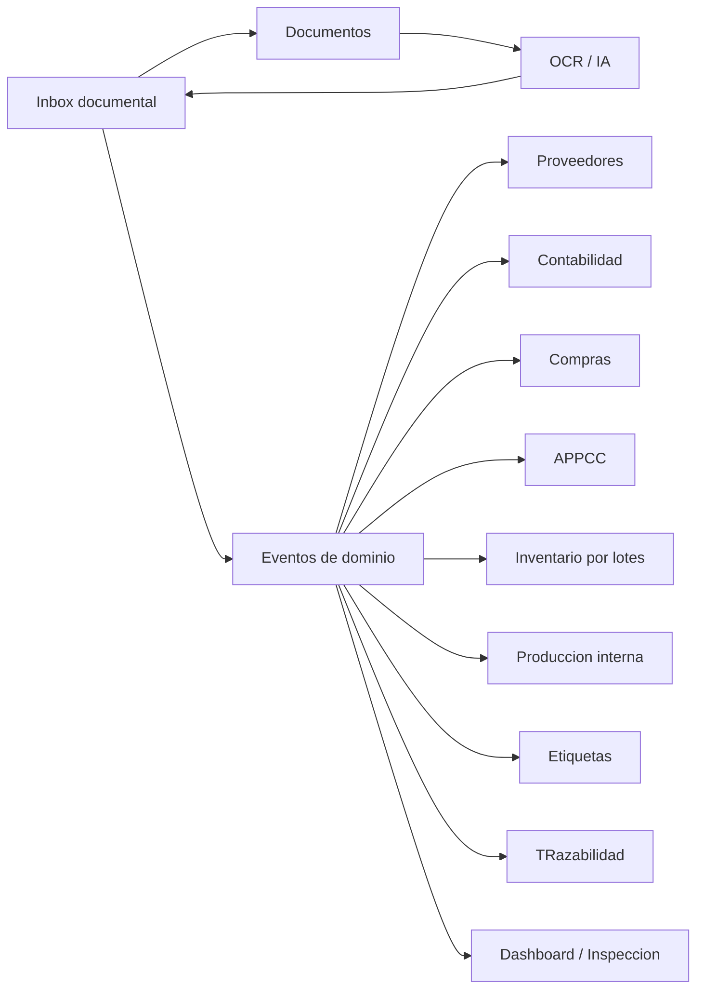

## Eventos

Eventos canonicos preparados:

- `DocumentUploaded`
- `DocumentClassified`
- `DocumentConfirmed`
- `SupplierCreated`
- `GoodsReceived`
- `InventoryLotCreated`
- `InventoryLotConsumed`
- `ProductionBatchCreated`
- `LabelPrinted`
- `AccountingDocumentCreated`
- `AccountingDocumentReconciled`
- `InspectionRecordCreated`
- `IncidentCreated`
- `WaterControlRecorded`
- `TemperatureRecorded`
- `CleaningRecorded`

Cada evento viaja como `DomainEventEnvelope` con:

- `id`
- `name`
- `occurredAt`
- `source`
- `actor`
- `correlationId`
- `causationId`
- `trace`
- `payload`

## Dispatcher

La infraestructura inicial vive en:

- `lib/admin-kiosko/domain/contracts.ts`
- `lib/admin-kiosko/domain/events.ts`
- `lib/admin-kiosko/domain/dispatcher.ts`
- `lib/admin-kiosko/domain/handlers`

El dispatcher es sincrono. En el futuro puede persistir eventos o delegar en una cola sin cambiar los eventos publicos.

### Fase actual: emision paralela sin efectos

Los flujos existentes empiezan a emitir eventos de dominio despues de completar su operacion principal. Esta emision es observabilidad pasiva:

- si un evento falla, la operacion principal no se revierte ni se rompe para el usuario;
- los handlers siguen siendo boundaries sin efectos reales;
- los eventos se persisten en `admin_domain_events` para auditoria interna;
- no hay event sourcing operativo todavia;
- no hay cola externa;
- no se crean inventario, contabilidad, etiquetas ni APPCC desde handlers.

El helper `emitDomainEventSafe` captura errores y permite activar trazas con:

```bash
ADMIN_KIOSKO_DOMAIN_EVENTS_DEBUG=true
```

Esta fase valida que los procesos reales generan eventos coherentes antes de mover efectos secundarios a handlers.

## Event Store

El Event Store interno vive en la tabla `admin_domain_events`, definida por:

- `supabase/admin_kiosko_event_store.sql`

Finalidad:

- auditoria sanitaria y operativa;
- trazabilidad de procesos OCR, documentos, inventario, APPCC, produccion y contabilidad;
- debugging de flujos;
- reconstruccion futura de expedientes;
- observabilidad de handlers.

No es todavia event sourcing: las tablas operativas actuales siguen siendo la fuente de verdad para el comportamiento de la aplicacion. Tampoco hay cola externa ni reintentos automaticos. La persistencia del evento y el estado por handler son pasivos y no deben duplicar efectos secundarios.

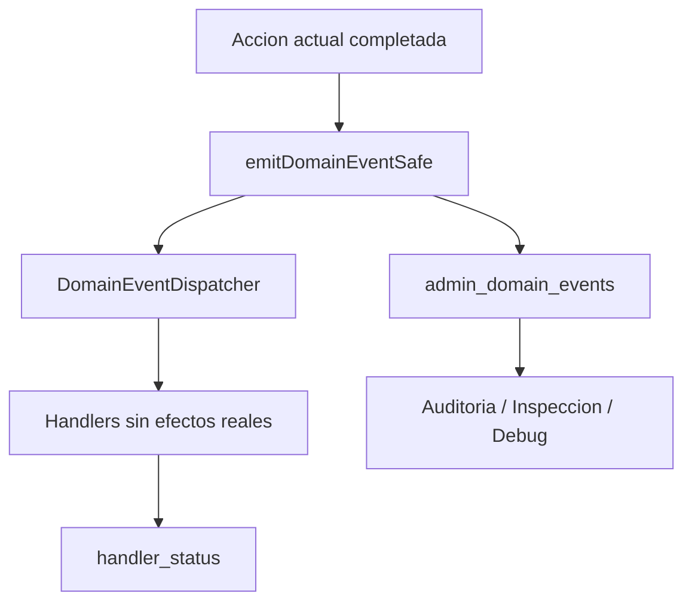

Estados del Event Store:

- `recorded`: evento guardado.
- `handled`: handlers ejecutados sin error.
- `failed`: fallo al ejecutar o marcar algun handler.
- `ignored`: reservado para descartes futuros.

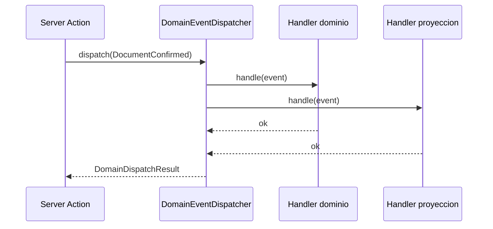

## Flujo documental

La entrada futura unica se llama **Subir documentos**. Debe sustituir progresivamente pantallas separadas de subida.

Tipos documentales esperados:

- `invoice`
- `delivery_note`
- `receipt`
- `supplier_traceability_label`
- `sanitary_document`
- `technical_sheet`
- `supplier_contract`
- `maintenance_document`
- `training_document`
- `other`

Estados documentales:

- `uploaded`
- `processing`
- `needs_review`
- `confirmed`
- `failed`
- `archived`

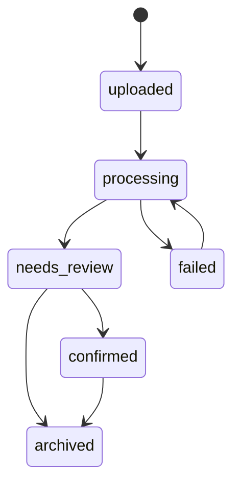

## Flujo OCR

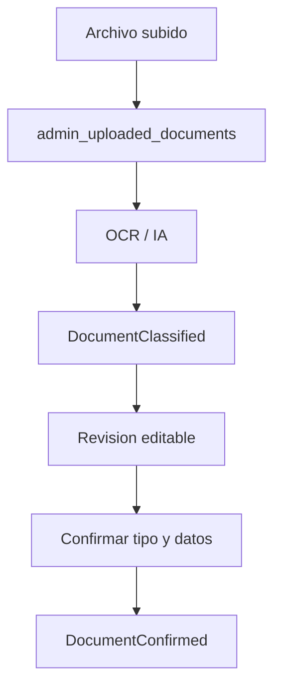

OCR solo debe extraer, clasificar y proponer datos. No debe impactar inventario, contabilidad o APPCC directamente.

## Flujo contabilidad

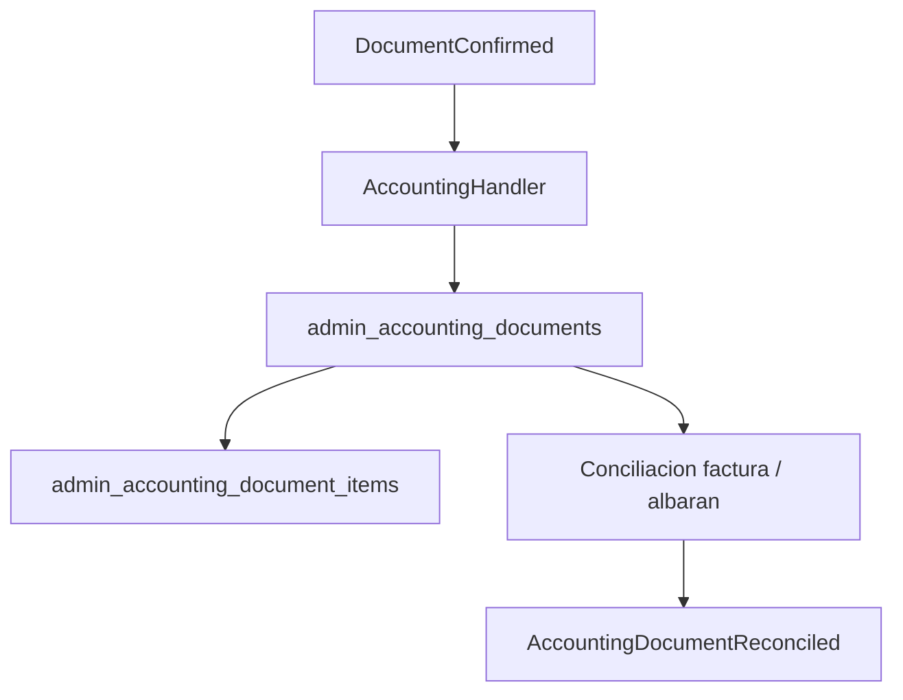

Contabilidad debe referenciar siempre `uploaded_document_id` cuando nace desde documento.

## Flujo compras y recepcion APPCC

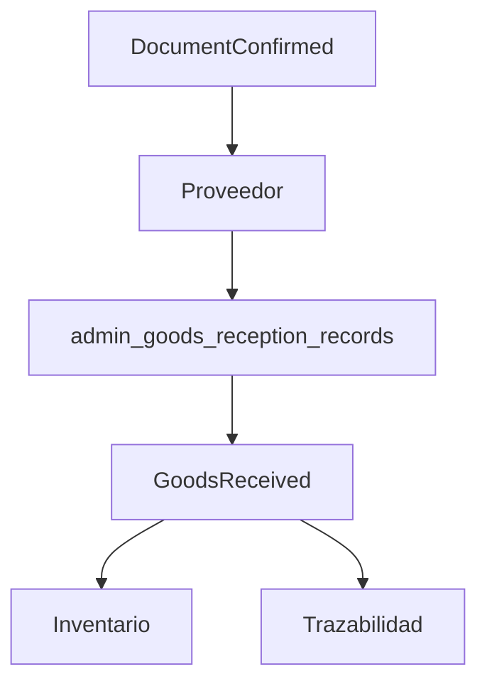

El albaran o documento de recepcion confirmado dispara `GoodsReceived`. Ese evento alimenta inventario, trazabilidad y dashboard mediante handlers.

## Flujo inventario

`admin_inventory_lots` debe ser la fuente de verdad del stock por lote. `admin_inventory_products` es resumen/cache.

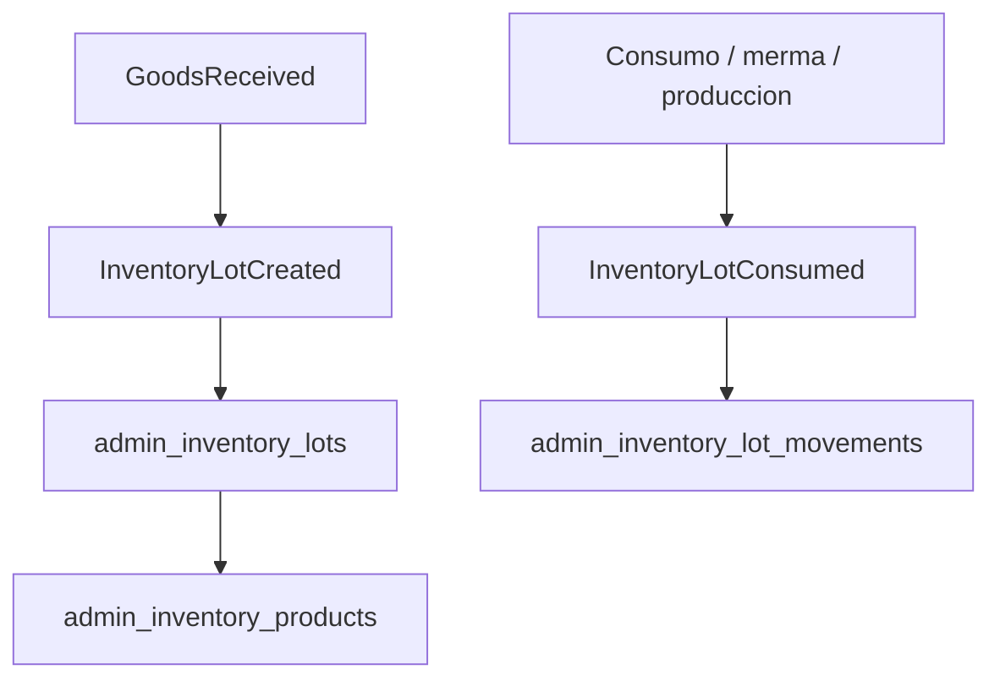

## Flujo produccion

Produccion consume lotes reales por FEFO y crea lotes internos. No debe conocer Zebra ni contabilidad.

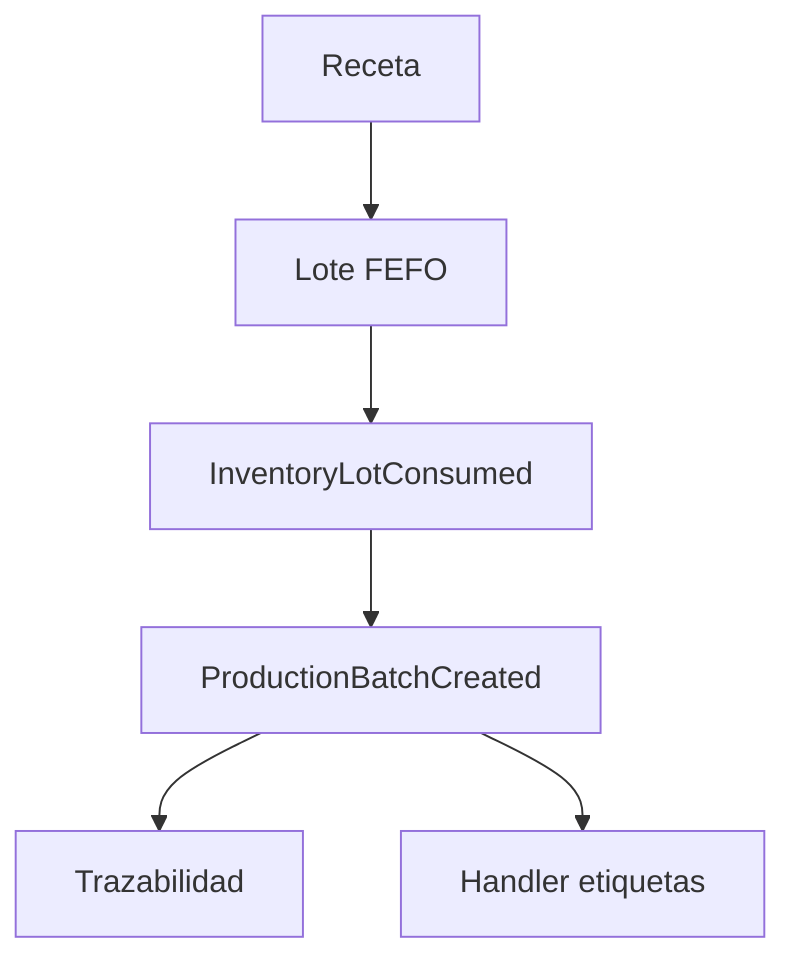

## Flujo APPCC

Los controles diarios generan eventos sanitarios:

- `TemperatureRecorded`
- `CleaningRecorded`
- `WaterControlRecorded`
- `InspectionRecordCreated`
- `IncidentCreated`

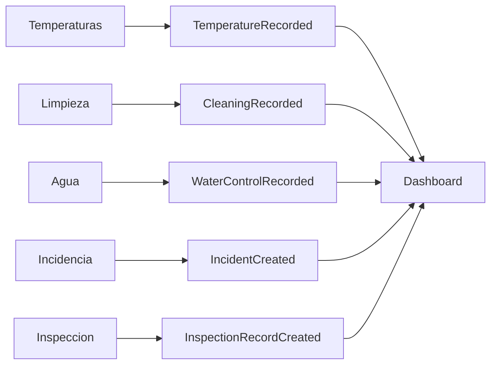

## Flujo etiquetas

Etiquetas debe reaccionar a eventos y guardar historial. Produccion o recepcion no deben depender de Zebra.

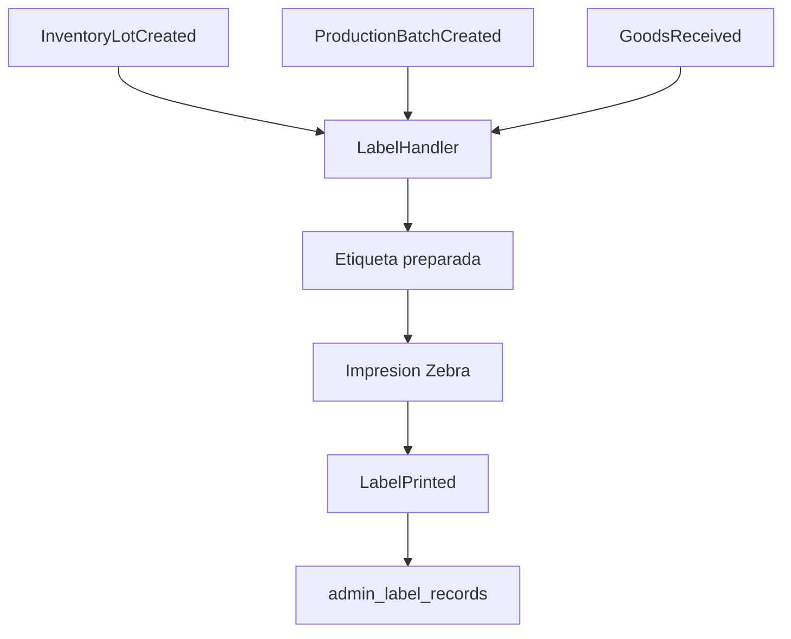

## Expedientes

Un expediente agrupa evidencias y eventos de un proceso sanitario o operativo.

Ejemplos:

- Compra Makro
- Produccion Pico de Gallo
- Incidencia sanitaria
- Inspeccion

Un expediente puede contener:

- documentos
- lotes
- productos
- producciones
- APPCC
- etiquetas
- contabilidad
- incidencias
- auditoria

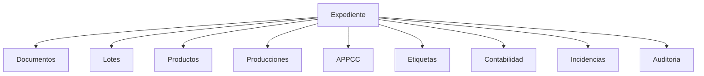

## Inbox ERP

La carpeta `lib/admin-kiosko/inbox` define los contratos para la futura entrada unica documental.

Flujo:

1. Subir uno o varios archivos.
2. Crear un `admin_uploaded_documents` por archivo.
3. Clasificar con IA.
4. Permitir correccion manual del tipo.
5. Confirmar.
6. Emitir `DocumentConfirmed`.
7. Derivar por handlers a contabilidad, compras, recepcion APPCC, inventario, trazabilidad, documentacion sanitaria o etiquetas.

## Migracion recomendada

1. Mantener server actions actuales funcionando.
2. Emitir eventos en paralelo despues de escrituras actuales.
3. Activar handlers sin efectos secundarios para observabilidad.
4. Mover efectos secundarios a handlers uno por uno.
5. Persistir eventos si se necesita auditoria completa o reintentos.
6. Convertir `admin_uploaded_documents` en entrada unica real.

## Que no tocar durante la migracion

- Autenticacion existente.
- `requireAdminSession`.
- Uso de `service_role` exclusivamente servidor.
- Rutas publicas.
- SEO y navegacion publica.
- Contratos publicos de `lib/admin-kiosko/database.ts` hasta que todos los consumidores migren.
