# Arquitectura ERP APPCC Kiosko Alfresko

Este documento define la arquitectura objetivo del ERP interno APPCC. El sistema deja de organizarse como pantallas aisladas y pasa a organizarse por procesos de negocio conectados mediante eventos de dominio.

## Principios

- `admin_uploaded_documents` es la raiz documental unica: cada archivo subido, individual o bulk, debe crear un registro aqui.
- Los modulos no deben conocer detalles internos de otros modulos.
- OCR no actualiza inventario directamente.
- Inventario no conoce contabilidad.
- Produccion no conoce Zebra.
- Los procesos se coordinan con eventos de dominio sin colas externas por ahora.
- La implementacion inicial puede ser sincrona, con contratos preparados para una cola persistente futura.
- Las pantallas existentes, server actions actuales e imports publicos deben seguir funcionando durante la migracion.

## Bounded Contexts

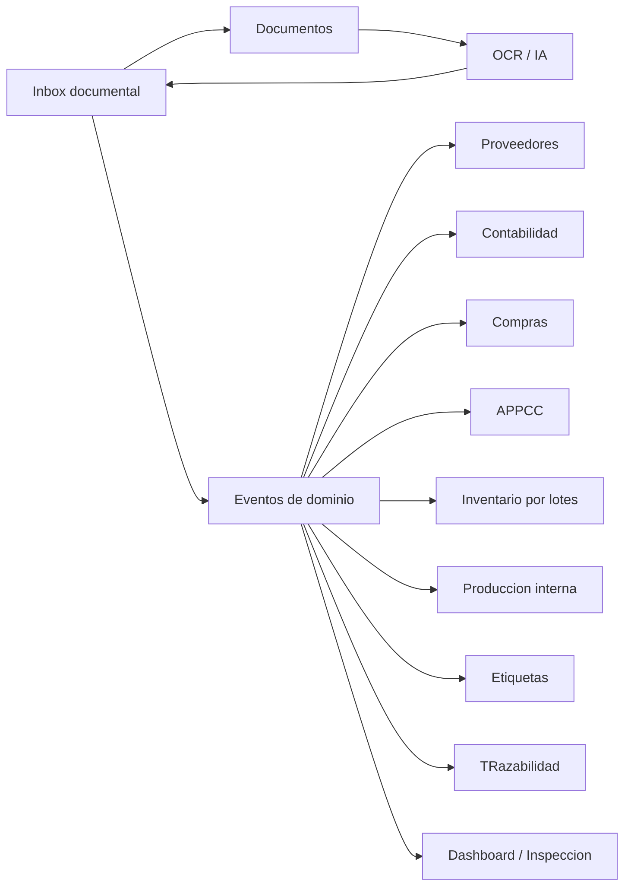

## Eventos

Eventos canonicos preparados:

- `DocumentUploaded`
- `DocumentClassified`
- `DocumentConfirmed`
- `SupplierCreated`
- `GoodsReceived`
- `InventoryLotCreated`
- `InventoryLotConsumed`
- `ProductionBatchCreated`
- `LabelPrinted`
- `AccountingDocumentCreated`
- `AccountingDocumentReconciled`
- `InspectionRecordCreated`
- `IncidentCreated`
- `WaterControlRecorded`
- `TemperatureRecorded`
- `CleaningRecorded`

Cada evento viaja como `DomainEventEnvelope` con:

- `id`
- `name`
- `occurredAt`
- `source`
- `actor`
- `correlationId`
- `causationId`
- `trace`
- `payload`

## Dispatcher

La infraestructura inicial vive en:

- `lib/admin-kiosko/domain/contracts.ts`
- `lib/admin-kiosko/domain/events.ts`
- `lib/admin-kiosko/domain/dispatcher.ts`
- `lib/admin-kiosko/domain/handlers`

El dispatcher es sincrono. En el futuro puede persistir eventos o delegar en una cola sin cambiar los eventos publicos.

### Fase actual: emision paralela sin efectos

Los flujos existentes empiezan a emitir eventos de dominio despues de completar su operacion principal. Esta emision es observabilidad pasiva:

- si un evento falla, la operacion principal no se revierte ni se rompe para el usuario;
- los handlers siguen siendo boundaries sin efectos reales;
- los eventos se persisten en `admin_domain_events` para auditoria interna;
- no hay event sourcing operativo todavia;
- no hay cola externa;
- no se crean inventario, contabilidad, etiquetas ni APPCC desde handlers.

El helper `emitDomainEventSafe` captura errores y permite activar trazas con:

```bash
ADMIN_KIOSKO_DOMAIN_EVENTS_DEBUG=true
```

Esta fase valida que los procesos reales generan eventos coherentes antes de mover efectos secundarios a handlers.

## Event Store

El Event Store interno vive en la tabla `admin_domain_events`, definida por:

- `supabase/admin_kiosko_event_store.sql`

Finalidad:

- auditoria sanitaria y operativa;
- trazabilidad de procesos OCR, documentos, inventario, APPCC, produccion y contabilidad;
- debugging de flujos;
- reconstruccion futura de expedientes;
- observabilidad de handlers.

No es todavia event sourcing: las tablas operativas actuales siguen siendo la fuente de verdad para el comportamiento de la aplicacion. Tampoco hay cola externa ni reintentos automaticos. La persistencia del evento y el estado por handler son pasivos y no deben duplicar efectos secundarios.

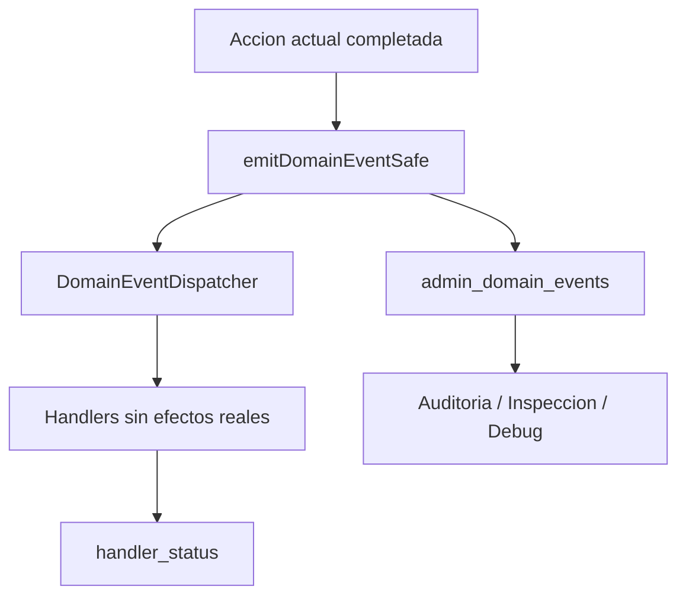

Estados del Event Store:

- `recorded`: evento guardado.
- `handled`: handlers ejecutados sin error.
- `failed`: fallo al ejecutar o marcar algun handler.
- `ignored`: reservado para descartes futuros.

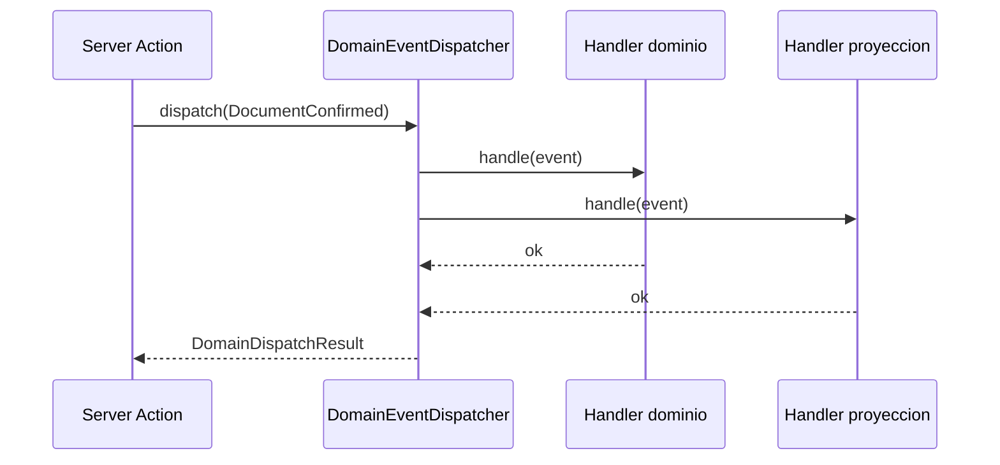

## Flujo documental

La entrada futura unica se llama **Subir documentos**. Debe sustituir progresivamente pantallas separadas de subida.

Tipos documentales esperados:

- `invoice`
- `delivery_note`
- `receipt`
- `supplier_traceability_label`
- `sanitary_document`
- `technical_sheet`
- `supplier_contract`
- `maintenance_document`
- `training_document`
- `other`

Estados documentales:

- `uploaded`
- `processing`
- `needs_review`
- `confirmed`
- `failed`
- `archived`

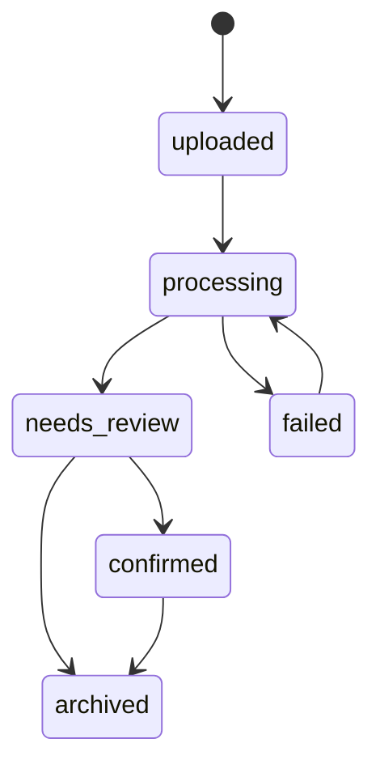

## Flujo OCR

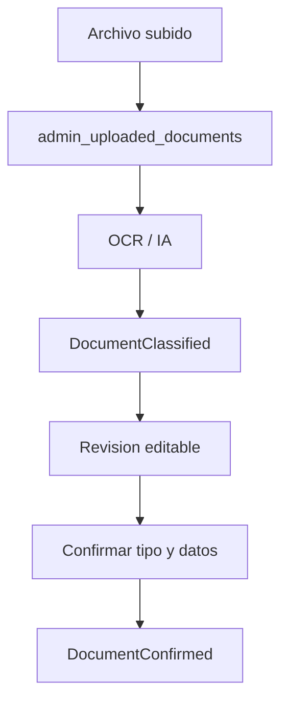

OCR solo debe extraer, clasificar y proponer datos. No debe impactar inventario, contabilidad o APPCC directamente.

## Flujo contabilidad

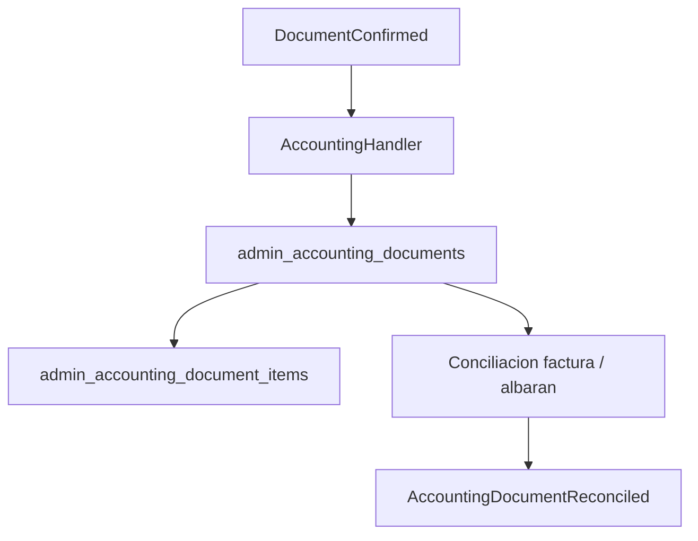

Contabilidad debe referenciar siempre `uploaded_document_id` cuando nace desde documento.

## Núcleo de compras

El núcleo profesional de compras se prepara de forma aditiva en:

- `supabase/admin_kiosko_purchase_core.sql`
- `lib/admin-kiosko/purchases/contracts.ts`
- `lib/admin-kiosko/purchases/normalization.ts`
- `lib/admin-kiosko/repositories/purchases.repository.ts`

El objetivo es conectar el flujo:

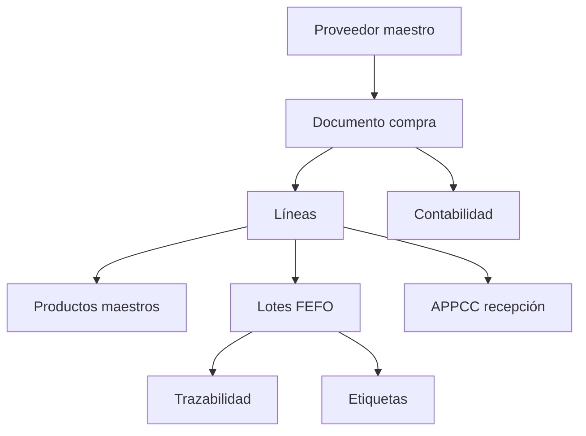

### Normalización proveedor/producto

El motor de normalización prepara:

- proveedor normalizado por nombre y CIF/NIF;
- producto normalizado por GTIN/EAN/nombre;
- candidatos de deduplicación;
- clasificación automática inicial:
  `food`, `beverage`, `alcohol`, `cleaning`, `packaging`, `equipment`, `service`, `other`.

La clasificación decide de forma preliminar si una línea requiere:

- trazabilidad alimentaria;
- recepción APPCC;
- lote de inventario;
- etiqueta;
- categoría contable;
- familia de producto;
- ubicación y temperatura de conservación sugeridas.

### Trazabilidad desde factura a lote

El SQL añade contratos de relación:

- `purchase_document_id`
- `purchase_line_id`
- `normalized_supplier_id`
- `normalized_product_id`
- `source_document_id`

Estos campos permiten enlazar factura/albarán, línea, producto maestro, lote FEFO, recepción APPCC, contabilidad y etiqueta sin duplicar archivos ni romper el OCR actual.

### Vistas de compras

Se preparan vistas de lectura:

- `admin_purchase_traceability_view`
- `admin_purchase_lines_pending_review_view`
- `admin_products_deduplication_candidates_view`
- `admin_stock_ready_for_labels_view`

Estas vistas son para auditoría, revisión y futuras pantallas; no sustituyen todavía el flujo actual.

### Importador histórico

El seed opcional:

- `supabase/seeds/admin_kiosko_historical_purchases_seed.sql`

no contiene datos productivos. Solo documenta el procedimiento para revisar facturas históricas ya subidas y enlazarlas manualmente con proveedores, productos, líneas y lotes cuando se decida hacer la migración.

## Flujo compras y recepcion APPCC

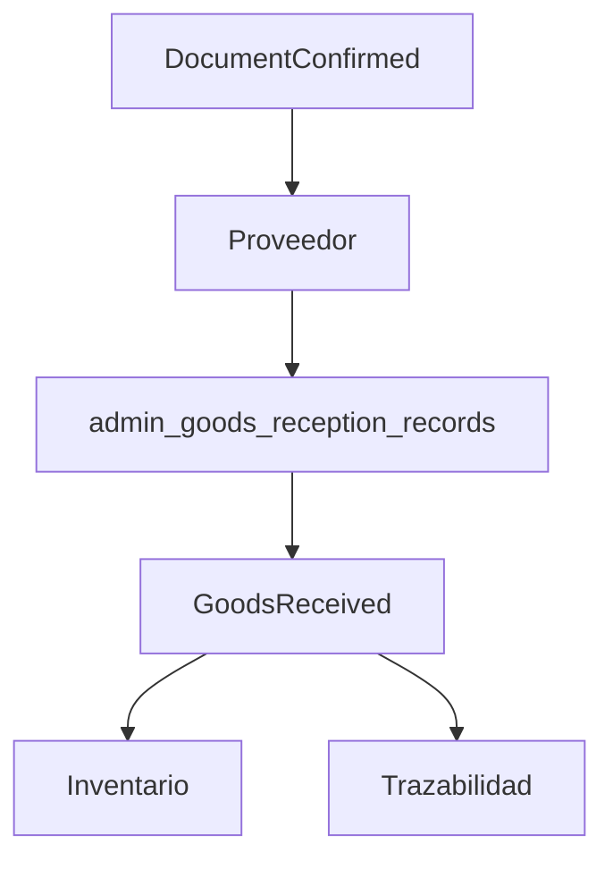

El albaran o documento de recepcion confirmado dispara `GoodsReceived`. Ese evento alimenta inventario, trazabilidad y dashboard mediante handlers.

## Flujo inventario

`admin_inventory_lots` debe ser la fuente de verdad del stock por lote. `admin_inventory_products` es resumen/cache.

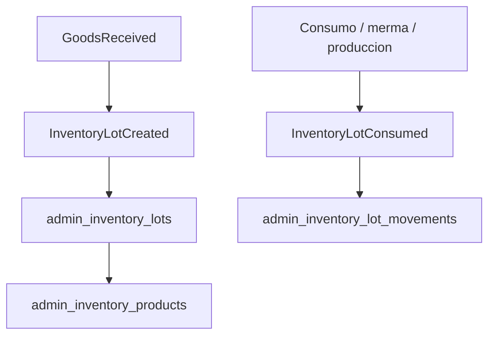

## Flujo produccion

Produccion consume lotes reales por FEFO y crea lotes internos. No debe conocer Zebra ni contabilidad.

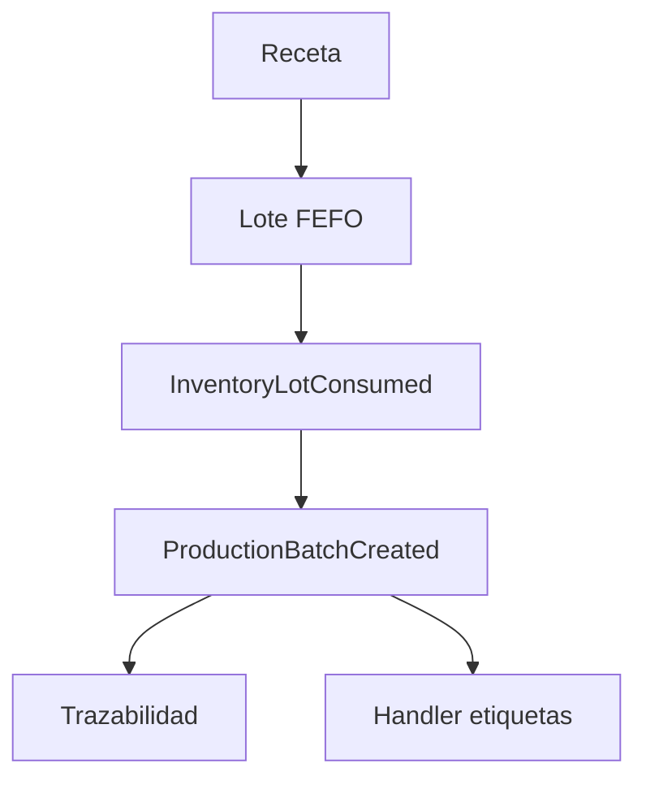

### Fichas técnicas y escalado productivo

Las recetas internas evolucionan a fichas técnicas productivas. La capa vive en:

- `lib/admin-kiosko/production/contracts.ts`
- `lib/admin-kiosko/production/recipe-scaling.ts`
- `lib/admin-kiosko/repositories/production.repository.ts`
- `supabase/admin_kiosko_recipe_scaling.sql`

El objetivo es poder pedir una cantidad objetivo, por ejemplo **3 kg de pico de gallo**, y obtener una vista previa productiva sin consumir stock todavía.

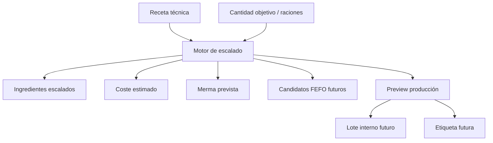

El motor calcula:

- factor de escala;
- ingredientes necesarios;
- cantidades escaladas;
- coste estimado cuando hay coste unitario;
- merma prevista;
- rendimiento final;
- alérgenos;
- pasos ordenados de elaboración;
- caducidad según conservación y vida útil;
- datos de etiqueta futura;
- disponibilidad FEFO futura por ingrediente.

En esta fase no se descuenta inventario real. La conexión FEFO se prepara con candidatos de lote, stock disponible, faltantes e ingrediente limitante. El consumo real debe ocurrir más adelante cuando el preview se confirme y se emita el flujo operativo correspondiente.

## Flujo APPCC

Los controles diarios generan eventos sanitarios:

- `TemperatureRecorded`
- `CleaningRecorded`
- `WaterControlRecorded`
- `InspectionRecordCreated`
- `IncidentCreated`

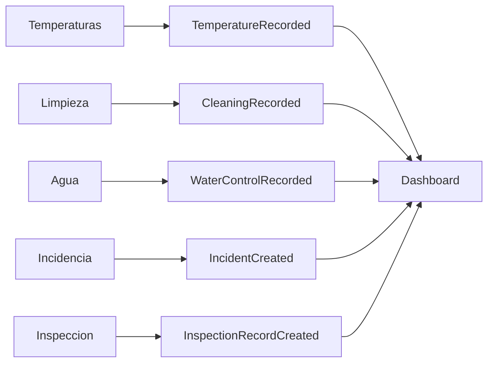

## Flujo etiquetas

Etiquetas debe reaccionar a eventos y guardar historial. Produccion o recepcion no deben depender de Zebra.

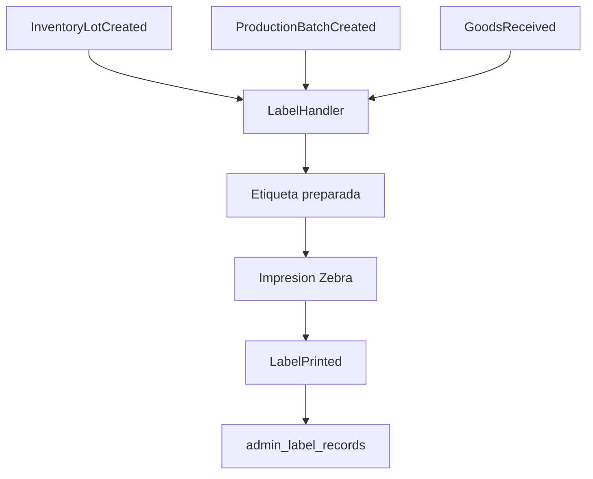

## Expedientes

Un expediente agrupa evidencias y eventos de un proceso sanitario o operativo.

Ejemplos:

- Compra Makro
- Produccion Pico de Gallo
- Incidencia sanitaria
- Inspeccion

Un expediente puede contener:

- documentos
- lotes
- productos
- producciones
- APPCC
- etiquetas
- contabilidad
- incidencias
- auditoria

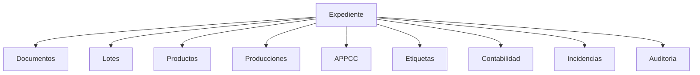

## Inbox ERP

La carpeta `lib/admin-kiosko/inbox` define los contratos para la futura entrada unica documental.

El backend real de la bandeja vive en:

- `lib/admin-kiosko/repositories/inbox.repository.ts`
- `uploadInboxDocumentsAction` en `app/admin-kiosko/actions.ts`

No existe todavia una UI compleja. La accion server-side ya permite subir uno o varios archivos mezclando PDF e imagenes. Cada archivo crea un registro individual en `admin_uploaded_documents` y comparte `upload_group_id` cuando pertenece a la misma subida.

Flujo:

1. Subir uno o varios archivos.
2. Crear un `admin_uploaded_documents` por archivo.
3. Emitir `DocumentUploaded`.
4. Clasificar con IA en una fase posterior.
5. Permitir correccion manual del tipo.
6. Confirmar.
7. Emitir `DocumentConfirmed`.
8. Derivar por handlers a contabilidad, compras, recepcion APPCC, inventario, trazabilidad, documentacion sanitaria o etiquetas.

### Upload groups

Un `upload_group_id` agrupa documentos relacionados en una misma operacion.

Ejemplo: **Compra Makro**

- factura
- albaran
- etiquetas de trazabilidad
- ficha tecnica o certificado del proveedor

Todos son documentos independientes en `admin_uploaded_documents`, pero comparten grupo. Esto evita duplicar archivos en tablas especificas y permite construir expedientes futuros.

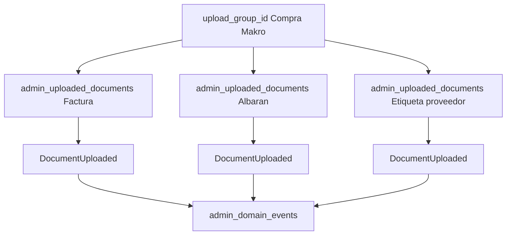

### Clasificacion documental

La bandeja soporta estos campos preparados:

- `classification_source`
- `classification_confidence`
- `classification_reason`
- `selected_type`
- `confirmed_type`

La IA todavia no se ejecuta automaticamente desde Inbox. El usuario podra corregir `selected_type` antes de confirmar. Solo la confirmacion debe disparar `DocumentConfirmed`.

### Relacion con expedientes

Un documento confirmado podra generar o alimentar expedientes:

- Expediente Compra
- Expediente Produccion
- Expediente Incidencia
- Expediente APPCC

La bandeja no crea expedientes todavia; deja los contratos y relaciones listos mediante `upload_group_id`, `admin_uploaded_documents` y eventos persistidos en `admin_domain_events`.

## Activacion de stock historico

El stock inicial real del ERP debe nacer de compras revisadas, no de altas manuales aisladas. La activacion se apoya en:

- `supabase/seeds/historical-purchases/kiosko_initial_purchases.json`
- `supabase/seeds/generated/admin_kiosko_initial_purchases_generated.sql`
- `supabase/admin_kiosko_inventory_activation.sql`
- `lib/admin-kiosko/repositories/inventory.repository.ts`

Flujo objetivo:

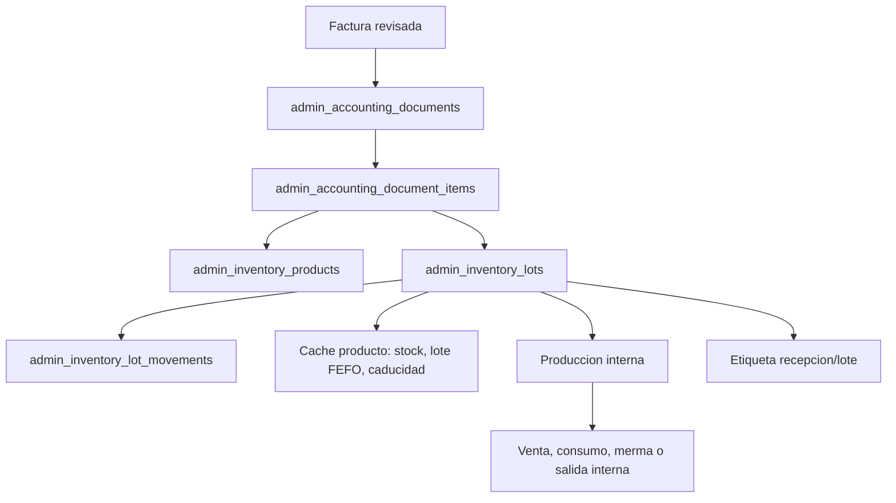

`admin_inventory_lots` es la fuente de verdad para stock por lote. `admin_inventory_products` queda como cache derivada para busquedas, dashboard e interfaces rapidas.

La funcion SQL `admin_activate_historical_stock()` es idempotente:

- crea productos si no existen por GTIN/EAN/nombre normalizado;
- enlaza lineas contables a productos normalizados;
- crea lotes solo si no existe `purchase_document_id + purchase_line_id`;
- crea movimientos de entrada solo si no existe ya el movimiento de esa linea;
- crea recepcion APPCC para lineas que lo requieren;
- reconstruye la cache de productos desde lotes activos.

Si una linea no tiene lote de fabricante, se conserva el lote interno generado por el importador:

```text
INIT-YYYYMMDD-SUPPLIER-PRODUCT
```

La vista `admin_inventory_ready_view` centraliza la lectura FEFO para produccion, etiquetas y revision:

- producto;
- lote;
- stock disponible;
- caducidad;
- proveedor;
- factura;
- ubicacion;
- posicion FEFO;
- listo para produccion;
- listo para etiqueta;
- pendiente de revision APPCC.

Las etiquetas todavia no se imprimen automaticamente en esta fase. Las funciones `previewInventoryLabel()` y `previewProductionLabel()` preparan los datos y el QR para que Zebra los consuma en un paso posterior.

## Revision APPCC de lotes importados

Los lotes importados desde compras historicas pueden llegar con lote, proveedor y factura, pero sin caducidad real documentada. El ERP no debe inventar caducidades. Para cerrar esa brecha se anade:

- `supabase/admin_kiosko_inventory_review.sql`
- `listInventoryLotsRequiringReview()`
- `updateInventoryLotReviewData()`
- `bulkApplyExpiryRulesPreview()`
- `bulkApplyExpiryRulesConfirm()`
- seccion **Lotes pendientes de revision** en `/admin-kiosko/inventario`

Campos de auditoria en `admin_inventory_lots`:

- `expiry_source`: `real_documentada`, `estimada_por_regla`, `revisada_manual`
- `reviewed_at`
- `reviewed_by`
- `review_notes`
- `appcc_review_status`: `pendiente_revision`, `revisado`, `requiere_documentacion`

Reglas internas de sugerencia:

- congelado: compra + 12 meses
- bebida envasada: compra + 12 meses
- salsas industriales cerradas: compra + 6 meses
- huevos: compra + 21 dias
- lacteos frescos: compra + 7 o 14 dias
- carnes frescas: compra + 3 dias
- verduras frescas: compra + 5 dias
- secos/ambiente: compra + 6 meses

Estas reglas generan solo sugerencias. Una sugerencia aplicada queda marcada como `estimada_por_regla`; no se presenta como `real_documentada`. Si la fecha procede de factura, etiqueta de proveedor o ficha tecnica, debe guardarse como `real_documentada` y documentarse en `review_notes`.

## Migracion recomendada

1. Mantener server actions actuales funcionando.
2. Emitir eventos en paralelo despues de escrituras actuales.
3. Activar handlers sin efectos secundarios para observabilidad.
4. Mover efectos secundarios a handlers uno por uno.
5. Persistir eventos si se necesita auditoria completa o reintentos.
6. Convertir `admin_uploaded_documents` en entrada unica real.

## Que no tocar durante la migracion

- Autenticacion existente.
- `requireAdminSession`.
- Uso de `service_role` exclusivamente servidor.
- Rutas publicas.
- SEO y navegacion publica.
- Contratos publicos de `lib/admin-kiosko/database.ts` hasta que todos los consumidores migren.
